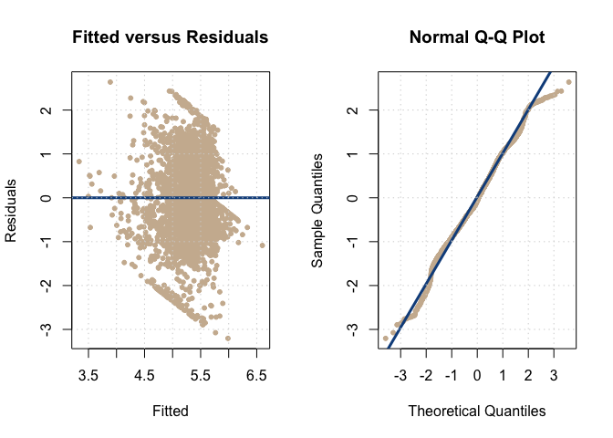

Unified Parkinson Disease Rating Scale (UPDRS) score prediction model study
================
Author: Oran Chan, Prashanti Nilayam, Heta Desai
Date: Aug-7-2020

-----
### Introduction

- For our analysis, we will be using the *Oxford Parkinson's Disease Telemonitoring Dataset* from the data file `parkinsons_updrs.csv`. 

- The dataset contains observations of biomedical voice measurements for remote symptom progression from 42 persons with early-stage parkinsons disease over a period of six months.


```r
parkinsons_updrs = read_csv("parkinsons_updrs.csv")

#Remove unused variables - subject#, motor_UPDRS
parkinsons_updrs = subset(x = parkinsons_updrs, select = -c(`subject#`, motor_UPDRS))

#Coerce to factor
parkinsons_updrs$sex = as.factor(parkinsons_updrs$sex)

#Simplified Headers
colnames(parkinsons_updrs) = c("age", "sex", "test_time", "total_updrs",
                               "jit_p", "jit_abs", "jit_rap",
                               "jit_ppq5", "jit_ddp", 
                               "shim", "shim_db", "shim_apq3", 
                               "shim_apq5", "shim_apq11", "shim_dda", 
                               "nhr", "hnr", "rpde", "dfa","ppe")
```

- The dataset has **20** attributes and **5875** observations.

- The dataset contains following attributes (18 out of 20 are listed)
     - `age` : Age of the subject
     - `sex` : Sex of the subject [`0` - male, `1` - female]
     - `test_time` : Number of days since recruitment into the trial
     - `total_updrs` : Total Unified Parkinson Disease Rating Scale (UPDRS) score
     - `jit_p`, `jit_abs`, `jit_rap`, `jit_ppq5`, `jit_ddp`
        - Measures of variation in fundamental frequency
     - `shim`, `shim_db`, `shim_apq3`, `shim_apq5`, `shim_apq11`, `shim_dda`
        - Measures of variation in amplitude
     - `rpde` : Dynamical complexity measure
     - `dfa` : Signal fractal scaling exponent
     - `ppe` : Fundamental frequency variation
     
- The dataset was created by Athanasios Tsanas (tsanasthanasis '@' gmail.com) and Max Little (littlem '@' physics.ox.ac.uk) of the University of Oxford, in collaboration with 10 medical centers in the US and Intel Corporation who developed the telemonitoring device to record the speech signals.

- The complete dataset and more details about it can be accessed online at http://archive.ics.uci.edu/ml/datasets/Parkinsons+Telemonitoring

- UPDRS score is the measure of disablity of a subject due to Parkinsons disease.

- The motivation behind the selection of this dataset is to try and build a model, which can predict the UPDRS score based on remote measurements of `jitter` and `shimmer` of the subject at an early stage.

- This might prove helpful in better prognosis for Parkinson disease for the subject.


### Methods


```r
#Prepare training and test sets
train_index = sample(1:nrow(parkinsons_updrs), 3000)
pk_trn = parkinsons_updrs[train_index, ]
pk_tst = parkinsons_updrs[-train_index, ]
```


```r
#Function to get LEAVE ONE OUT CROSS VALIDATION RMSE for a model fitted with least square method
loocv_rmse = function(model){
  sqrt(mean((resid(model) / (1 - hatvalues(model)))^2))
}
```


```r
#Function to get RMSE for a model fitted with least square method
get_rmse = function(actual, fitted){
  sqrt(sum((actual - fitted) ^ 2) / length(actual))
}
```


```r
# Utility functions to analyze high leverage points using hatvalues [h > 2*mean(h)]
leverage_high = function(model, return = "values" ){
  n = length(resid(model))
  h = hatvalues(model)
  
  if (return == "values"){
    h[h > 2 * mean(h)] 
  }else if(return == "prop"){
    mean(h > 2 * mean(h))
  }else{
    which(h > 2 * mean(h))
  }
}
```


```r
# Utility function to extract lambda value from BOX-COX transformation
get_lambda_from_boxcox = function(model, plotit = FALSE){
  bx = boxcox(model, plotit = plotit)
  bx$x[which.max(bx$y)]
}
```


```r
# Utility functions to analyze influential points using cooks.distance [cd > 4/n]
cooksdist_high = function(model, return = "values"){
  n = length(resid(model))
  cd = cooks.distance(model)
  
  if (return == "values"){
    cd[(cd > 4 / n)]
  }else if(return == "prop"){
    mean(cd > 4 / n)
  }else{
    which(cd > 4 / n)
  }
}
```


```r
#Partial Correlation with added predictor
pcorr = function(response, test_predictor, dataset){
  model1 = lm(as.formula(paste(test_predictor, paste(". - ", response) ,sep=" ~ ")), 
              data = dataset)
  model2 = lm(as.formula(paste(response, paste(". - ", test_predictor) ,sep=" ~ ")), 
              data = dataset)
  cor(resid(model1), resid(model2))
}
```


```r
#Performance Metrics with RMSE, LOOVC rmse, Cooks Distance, Adjusted R^2, Shapiro Wilk test and BP test
performance_metrics = function(model1, model2= 0, model3 = 0, trainset, testset, single_mod = FALSE){
  
  if (single_mod == TRUE){
       df = data.frame(Train.RMSE = c(get_rmse(trainset$total_updrs, fitted(model1))),
                      Test.RMSE = c(get_rmse(testset$total_updrs, predict(model1, testset))),
                      LOOCV.rmse = c(loocv_rmse(model1)),
                      Adj.R2 = c(summary(model1)$adj.r.squared),
                      Shapiro.Wilk = c(format(shapiro.test(resid(model1))$p.value, digits=2)),
                      BP.test = c(format(bptest(model1)$p.value, digits=2)))
       colnames(df) = c("Train RMSE", "Test RMSE", "LOOCV RMSE", "Adj R2", "Shapiro Wilk p-val", "BP p-val")
       rownames(df) = c("")
  }else{
      df = data.frame(Train.RMSE = c(get_rmse(trainset$total_updrs, fitted(model1)), 
                                     get_rmse(trainset$total_updrs, fitted(model2)),
                                     get_rmse(trainset$total_updrs, fitted(model3))),
                      Test.RMSE = c(get_rmse(testset$total_updrs, predict(model1, testset)), 
                                    get_rmse(testset$total_updrs, predict(model2, testset)),
                                    get_rmse(testset$total_updrs, predict(model3, testset))),
                      LOOCV.rmse = c(loocv_rmse(model1), loocv_rmse(model2),  loocv_rmse(model3)),
                      Adj.R2 = c(summary(model1)$adj.r.squared,
                                 summary(model2)$adj.r.squared,
                                 summary(model3)$adj.r.squared),
                      Shapiro.Wilk = c(format(shapiro.test(resid(model1))$p.value, digits=2),
                                       format(shapiro.test(resid(model2))$p.value, digits=2),
                                       format(shapiro.test(resid(model3))$p.value, digits=2)),
                      BP.test = c(format(bptest(model1)$p.value, digits=2),
                                  format(bptest(model2)$p.value, digits=2),
                                  format(bptest(model3)$p.value, digits=2)))
      
      rownames(df) = c("Small Model", "Interaction Model", "Int Model w/o Influential points")
      colnames(df) = c("Train RMSE", "Test RMSE", "LOOCV RMSE", "Adj R2", "Shapiro Wilk p-val", "BP p-val")
  }
  kable(df)
}
```


```r
# Fitted-Residuals and Q-Q Plot
diagnostics = function(model, pcol = "bisque3", lcol = "dodgerblue4", plotit = TRUE, testit = TRUE) {
  if (plotit == TRUE) {
    # side-by-side plots (one row, two columns)
    par(mfrow = c(1, 2))
    # fitted versus residuals
    plot(fitted(model), resid(model), 
         col = pcol, pch = 20, cex = 1, 
         xlab = "Fitted", ylab = "Residuals", 
         main = "Fitted versus Residuals")
    abline(h = 0, col = lcol, lwd = 3)
    grid()
    # qq-plot
    qqnorm(resid(model), col = pcol, pch = 20, cex = 1)
    qqline(resid(model), col = lcol, lwd = 3)
    grid()
  }
  if (testit == TRUE) {
    sw_p_val = shapiro.test(resid(model))$p.value
    bp_p_val = bptest(model)$p.value
    adj_r_sq = summary(model)$adj.r.squared
    list(sw_p_val = sw_p_val, bp_p_val = bp_p_val, adj_r_sq = adj_r_sq)
  }
}
```


```r
# Convert correlation into heat map
# Slice diagonally on correlation matrix
slice_upper_tri = function(corpak){
  corpak[lower.tri(corpak)] = NA
  corpak
}

reorder_matrix = function(corpk){
    dist = as.dist((1-corpk)/2)
    hcl = hclust(dist)
    corpk = corpk[hcl$order, hcl$order]
}

cor_heat_map_reorder = function(corpk){
  
  corpk = reorder_matrix(corpk)
  upper_tri = slice_upper_tri(corpk)
  # Melt the correlation matrix
  corpk_melt = melt(upper_tri, na.rm = TRUE)
  # ggheatmap
  ggheatmap = ggplot(corpk_melt, aes(Var2, Var1, fill = value)) +
    geom_tile(color = "black") +
    scale_fill_gradient2(low = "navy", high = "darkorange", mid = "white",
                         midpoint = 0, limit = c(-1,1), space = "Lab",
                         name="Correlation") +
    theme_minimal() +
    theme(axis.text.x = element_text(angle = 30, vjust = 1,
                                     size = 12, hjust = 1)) + coord_fixed()
    ggheatmap + 
    geom_text(aes(Var2, Var1, label = value), color = "darkblue", size = 2.5) +
    theme(
       axis.title.x = element_blank(), axis.title.y = element_blank(),
       legend.justification = c(1, 0), legend.position = c(0.45, 0.6),
       legend.direction = "vertical") +
          guides(fill = guide_colorbar(barwidth = 1, barheight = 6,
                                 title.position = "top", title.hjust = 0.7))
}

#Partial Correlation with added predictor
pcorr_plot = function(orig_ml, dataset, added_predictor, plotit=TRUE, show_formula=FALSE){
  
  coef = names(summary(orig_ml)$coef[,1])[-1]
  pdt_string = ""
  for (i in 1:length(coef)){
    if (i != length(coef)){
      pdt_string = paste(pdt_string, paste(coef[i],"+"))
    }else{
      pdt_string = paste(pdt_string, coef[i])
    }
  }
  
  pdt_string = gsub("sex1","sex",pdt_string)
  
  # Fit new predictor 
  formula = as.formula(paste(added_predictor, pdt_string ,sep=" ~ "))
  ml_new = lm(formula, dataset)
  
  #Plot
  if (plotit == TRUE){
    #par(mfrow=c(1,1))
    #cor(resid(orig_ml), resid(ml_new))
    plot(resid(orig_ml) ~ resid(ml_new), col = "dodgerblue",
         cex=0.5, pch = 20,
         ylab = "Residuals - Original Model",
         xlab = paste("Residuals - Added Predictor", added_predictor, sep = " - "),
         main = "Variable Added Plot")
    abline(v=0, lty = 2)
    abline(h=0, lty = 2)
    abline(lm(resid(orig_ml) ~ resid(ml_new)), col='orange', lwd = 2)
  }
  
  if (show_formula != TRUE){
    list(pcor = cor(resid(orig_ml), resid(ml_new)))
  }else{
    formula
  }
}
```

<br>

- We start our analysis with full additive model. 


```r
full_model = lm(total_updrs ~ . , data = pk_trn)
diagnostics(full_model, testit = FALSE, plotit = TRUE)
```

<!-- -->
<center> __Figure.1 - Additive Model (Fitted-Residuals & Q-Q Plot)__ </center>
<br>

- As we can observe in the above *Fitted vs Residuals* and *Q-Q plot*, the model seems to be voilating *Normality assumption* and *Equal Variance assumption*. 

- We start with a look at the possible collinearity issues in the model.


```r
vif(full_model)
```

```
##        age       sex1  test_time      jit_p    jit_abs    jit_rap   jit_ppq5 
##  1.089e+00  1.400e+00  1.009e+00  1.117e+02  1.128e+01  1.380e+06  4.012e+01 
##    jit_ddp       shim    shim_db  shim_apq3  shim_apq5 shim_apq11   shim_dda 
##  1.380e+06  1.988e+02  7.431e+01  2.494e+07  4.964e+01  1.549e+01  2.494e+07 
##        nhr        hnr       rpde        dfa        ppe 
##  9.447e+00  5.517e+00  2.160e+00  1.655e+00  4.385e+00
```

- It is very evident from the above results of `vif` that our model has collinearity issues with `vif` values much larger than `5` for many predictors.
- We can have a quick look at the correlated predictors using below heatmap.


```r
corpk = round(cor(pk_trn[, -2]), 2) #remove non-numeric, Sex variable
cor_heat_map_reorder(corpk)
```

<!-- -->

<center> __Figure.1b - Variable Correlation__ </center>
<br>

- Clearly, many predictors are correlated among themselves.

- We remove the predictors which are related with high `vif` values to obtain a new additive model.


```r
full_model_non_collinear = lm(total_updrs ~  age + sex + test_time + jit_p +shim_apq11 + hnr + rpde + dfa + ppe, 
                              data = pk_trn)
vif(full_model_non_collinear)
```

```
##        age       sex1  test_time      jit_p shim_apq11        hnr       rpde 
##      1.061      1.108      1.004      2.621      2.750      4.554      1.933 
##        dfa        ppe 
##      1.250      3.297
```

- Upon examining the vif values again, we can observe that the collinearity issue is fixed now. All the `vif` values are satisfactorily small.

- We can confirm this by having a look at the partial correlation coefficient values for the selected predictors.


```r
predictors = c("age", "test_time", "jit_p", "shim_apq11", "hnr", "rpde", "dfa", "ppe")
predictors = predictors[!predictors %in% c("total_updrs", "sex")]
sort(sapply(predictors, pcorr, response = "total_updrs", dataset = pk_trn ))
```

```
##        dfa        hnr      jit_p shim_apq11       rpde        ppe  test_time 
##  -0.155953  -0.116631   0.006379   0.020641   0.030276   0.074596   0.082229 
##        age 
##   0.257688
```

- All the `pcorr` values are quite small in magnitude which indicates that the model does not have collinearity issues.

- We can have a look at the diagnostics again for the improved model.


```r
diagnostics(full_model_non_collinear, testit = FALSE, plotit = TRUE)
```

<!-- -->

```r
performance_metrics(full_model_non_collinear, trainset = pk_trn, testset = pk_tst, single_mod = TRUE)
```


|   | Train RMSE| Test RMSE| LOOCV RMSE| Adj R2|Shapiro Wilk p-val |BP p-val |
|:--|----------:|---------:|----------:|------:|:------------------|:--------|
|   |      9.815|     9.851|      9.848| 0.1485|8.8e-21            |3.3e-25  |

- The model still seems to voilate the assumptions as we can see on the plot above which is also confirmed by the `p-values` for both `Shapiro.wilk` and `bptest` for the model.

- We try to further improve our model by using `transformations`.

- We can use `box-cox` method to get the appropriate ransformation function for `response` transformation.


```r
lambda = get_lambda_from_boxcox(model = full_model_non_collinear, plotit = TRUE )
```

<!-- -->

- We get the `best` lambda value for response as 0.6263 which is close to *.5* . For simplicity, we consider `sqrt` as the function for response transformation.


```r
resp_xformed_model = lm(sqrt(total_updrs) ~  age + sex + test_time + jit_p +shim_apq11 + hnr + rpde + dfa + ppe, data = pk_trn)
diagnostics(resp_xformed_model, testit = FALSE, plotit = TRUE)
```

<!-- -->


```r
performance_metrics(resp_xformed_model, trainset = pk_trn, testset = pk_tst, single_mod = TRUE)
```


|   | Train RMSE| Test RMSE| LOOCV RMSE| Adj R2|Shapiro Wilk p-val |BP p-val |
|:--|----------:|---------:|----------:|------:|:------------------|:--------|
|   |      25.97|     25.95|     0.9362| 0.1612|1.3e-14            |2.6e-25  |

- There is definitely an improvement in the `Q-Q` plot for this model. The value for `shapiro.wilk` test has reduced considerably too.

- However, the *Equal variance* assumption still seems to be voilated and even *Normality assumption* is suspect.

- To look for the possibility of additional transformations with the available predictors, we can have a quick visual look at the relationships using `pairs`.


```r
pairs(pk_trn[, c("age", "test_time", "jit_p", "shim_apq11", "hnr", "rpde", "dfa", "ppe")], col = "darkorange4")
```

<!-- -->

- After trying for a lot of combinations of different transformations for the predictors and multiple variable selection mesaures, below model shows significant improvement.


```r
start_model = lm(sqrt(total_updrs) ~  (jit_p + shim_db + hnr + dfa + sqrt(ppe)), data = pk_trn)
xformed_model  = step(start_model, trace = 0)
diagnostics(xformed_model, testit = FALSE, plotit = TRUE)
```

<!-- -->

- The *Fitted vs Residuals* and *Q-Q* plot above for the model looks much better than the previous models.
- We can also have a look at the `p-values` for `shapiro.wilk` and `bptest` values.


```r
performance_metrics(xformed_model, trainset = pk_trn, testset = pk_tst, single_mod = TRUE)
```


|   | Train RMSE| Test RMSE| LOOCV RMSE| Adj R2|Shapiro Wilk p-val |BP p-val |
|:--|----------:|---------:|----------:|------:|:------------------|:--------|
|   |         26|     25.98|     0.9785| 0.0821|2.9e-10            |7.6e-09  |

- The `p-values` for `shapiro.wilk` and `bptest` are still low, however, they have improved greatly compared to the previous models.

- The `summary` of the selected model after transformations and variable selection is below.


```r
summary(xformed_model)
```

```
## 
## Call:
## lm(formula = sqrt(total_updrs) ~ (jit_p + shim_db + hnr + dfa + 
##     sqrt(ppe)), data = pk_trn)
## 
## Residuals:
##     Min      1Q  Median      3Q     Max 
## -3.0864 -0.6582 -0.0807  0.7169  2.4618 
## 
## Coefficients:
##              Estimate Std. Error t value Pr(>|t|)    
## (Intercept)   7.96210    0.34878   22.83  < 2e-16 ***
## jit_p       -15.30340    5.17121   -2.96   0.0031 ** 
## shim_db      -0.58921    0.14708   -4.01  6.3e-05 ***
## hnr          -0.05792    0.00861   -6.73  2.0e-11 ***
## dfa          -3.34160    0.27978  -11.94  < 2e-16 ***
## sqrt(ppe)     2.28616    0.32628    7.01  3.0e-12 ***
## ---
## Signif. codes:  0 '***' 0.001 '**' 0.01 '*' 0.05 '.' 0.1 ' ' 1
## 
## Residual standard error: 0.978 on 2994 degrees of freedom
## Multiple R-squared:  0.0837,	Adjusted R-squared:  0.0821 
## F-statistic: 54.7 on 5 and 2994 DF,  p-value: <2e-16
```

- We can see the `p-value` for the predictor `jit_p` is comparatively higher which indicates that `jit_p` might be non-significant.

- We can performe `F` test or `t` test to test the significance of the predictor `jit_p`.


```r
xformed_small_model = lm(sqrt(total_updrs)  ~ shim_db + hnr + dfa+ sqrt(ppe), data = pk_trn)
(aov = anova(xformed_small_model, xformed_model))
```

```
## Analysis of Variance Table
## 
## Model 1: sqrt(total_updrs) ~ shim_db + hnr + dfa + sqrt(ppe)
## Model 2: sqrt(total_updrs) ~ (jit_p + shim_db + hnr + dfa + sqrt(ppe))
##   Res.Df  RSS Df Sum of Sq    F Pr(>F)   
## 1   2995 2870                            
## 2   2994 2862  1      8.37 8.76 0.0031 **
## ---
## Signif. codes:  0 '***' 0.001 '**' 0.01 '*' 0.05 '.' 0.1 ' ' 1
```

- Based on above test results , we *fail to reject* the hypothesis $H_0: \beta_{jit_p} =0$ at $\alpha = .01$.

- Hence we choose smaller model for our analysis.

- We can have a look at the possible interactions of the predictors within the model.


```r
xformed_int_model = lm(sqrt(total_updrs)  ~ (shim_db + hnr + dfa+ sqrt(ppe))^2, 
                  data = pk_trn)
summary(xformed_int_model)
```

```
## 
## Call:
## lm(formula = sqrt(total_updrs) ~ (shim_db + hnr + dfa + sqrt(ppe))^2, 
##     data = pk_trn)
## 
## Residuals:
##    Min     1Q Median     3Q    Max 
## -3.205 -0.644 -0.062  0.695  2.637 
## 
## Coefficients:
##                   Estimate Std. Error t value Pr(>|t|)    
## (Intercept)        15.0305     2.6787    5.61  2.2e-08 ***
## shim_db            -1.2764     1.4058   -0.91    0.364    
## hnr                -0.1555     0.0744   -2.09    0.037 *  
## dfa                -2.2914     4.0232   -0.57    0.569    
## sqrt(ppe)         -24.5544     3.6575   -6.71  2.3e-11 ***
## shim_db:hnr         0.0981     0.0201    4.87  1.2e-06 ***
## shim_db:dfa        -8.6541     2.2064   -3.92  9.0e-05 ***
## shim_db:sqrt(ppe)  10.4990     1.6057    6.54  7.3e-11 ***
## hnr:dfa            -0.2902     0.1187   -2.44    0.015 *  
## hnr:sqrt(ppe)       0.5894     0.0764    7.71  1.7e-14 ***
## dfa:sqrt(ppe)      15.7314     4.0215    3.91  9.4e-05 ***
## ---
## Signif. codes:  0 '***' 0.001 '**' 0.01 '*' 0.05 '.' 0.1 ' ' 1
## 
## Residual standard error: 0.963 on 2989 degrees of freedom
## Multiple R-squared:  0.112,	Adjusted R-squared:  0.109 
## F-statistic: 37.6 on 10 and 2989 DF,  p-value: <2e-16
```


```r
performance_metrics(xformed_int_model, trainset = pk_trn, testset = pk_tst, single_mod = TRUE)
```


|   | Train RMSE| Test RMSE| LOOCV RMSE| Adj R2|Shapiro Wilk p-val |BP p-val |
|:--|----------:|---------:|----------:|------:|:------------------|:--------|
|   |      25.99|     25.97|     0.9647| 0.1087|2.7e-10            |1.4e-07  |

- We can see that in the interaction model, there is an improvement in `adjusted r-squared` while `p-values` for the diagnostics are similar.

-We can perform `F` test to test the significance of the model.


```r
(aov1 = anova(xformed_small_model, xformed_int_model))
```

```
## Analysis of Variance Table
## 
## Model 1: sqrt(total_updrs) ~ shim_db + hnr + dfa + sqrt(ppe)
## Model 2: sqrt(total_updrs) ~ (shim_db + hnr + dfa + sqrt(ppe))^2
##   Res.Df  RSS Df Sum of Sq    F Pr(>F)    
## 1   2995 2870                             
## 2   2989 2774  6      95.7 17.2 <2e-16 ***
## ---
## Signif. codes:  0 '***' 0.001 '**' 0.01 '*' 0.05 '.' 0.1 ' ' 1
```

- Based on the above result of `anova`, `p-value` for `F` test = 1.2346\times 10^{-19} is very low. We *reject* the null hypothesis.

- We can further analyze for *influential points* that might have impacted the model.


```r
xformed_wo_infl_model = lm(sqrt(total_updrs)  ~ (shim_db + hnr + dfa+ sqrt(ppe))^2, 
                  data = pk_trn,
                  subset = cooks.distance(xformed_int_model) <= 4 / length(resid(xformed_int_model)))
```


```r
performance_metrics(xformed_wo_infl_model, trainset = pk_trn, testset = pk_tst, single_mod = TRUE)
```


|   | Train RMSE| Test RMSE| LOOCV RMSE| Adj R2|Shapiro Wilk p-val |BP p-val |
|:--|----------:|---------:|----------:|------:|:------------------|:--------|
|   |      26.03|     25.96|      0.925| 0.1378|7.2e-10            |9.2e-07  |

- After removing the influential points, we do see some improvemnt in the `adj r-squared` and `loocv` values.

- The model now looks pretty good. We can have one more iteration of variable selection. We choose `BIC` for this.


```r
bic_model = step(xformed_wo_infl_model, k = log(length(resid(xformed_int_model))), trace = 0)
diagnostics(bic_model, testit = FALSE, plotit = TRUE)
```

<!-- -->


```r
summary(bic_model)
```

```
## 
## Call:
## lm(formula = sqrt(total_updrs) ~ (shim_db + hnr + dfa + sqrt(ppe))^2, 
##     data = pk_trn, subset = cooks.distance(xformed_int_model) <= 
##         4/length(resid(xformed_int_model)))
## 
## Residuals:
##     Min      1Q  Median      3Q     Max 
## -2.8839 -0.6336 -0.0493  0.6531  2.3597 
## 
## Coefficients:
##                   Estimate Std. Error t value Pr(>|t|)    
## (Intercept)        13.5524     2.7760    4.88  1.1e-06 ***
## shim_db            -0.8093     1.6039   -0.50     0.61    
## hnr                -0.0943     0.0774   -1.22     0.22    
## dfa                 3.9423     4.1640    0.95     0.34    
## sqrt(ppe)         -29.9851     3.7964   -7.90  4.0e-15 ***
## shim_db:hnr         0.1439     0.0243    5.91  3.7e-09 ***
## shim_db:dfa       -14.3560     2.4996   -5.74  1.0e-08 ***
## shim_db:sqrt(ppe)  15.5071     1.9708    7.87  5.0e-15 ***
## hnr:dfa            -0.5306     0.1235   -4.30  1.8e-05 ***
## hnr:sqrt(ppe)       0.7847     0.0814    9.64  < 2e-16 ***
## dfa:sqrt(ppe)      15.8928     4.0329    3.94  8.3e-05 ***
## ---
## Signif. codes:  0 '***' 0.001 '**' 0.01 '*' 0.05 '.' 0.1 ' ' 1
## 
## Residual standard error: 0.924 on 2903 degrees of freedom
## Multiple R-squared:  0.141,	Adjusted R-squared:  0.138 
## F-statistic: 47.5 on 10 and 2903 DF,  p-value: <2e-16
```


```r
performance_metrics(bic_model, trainset = pk_trn, testset = pk_tst, single_mod = TRUE)
```


|   | Train RMSE| Test RMSE| LOOCV RMSE| Adj R2|Shapiro Wilk p-val |BP p-val |
|:--|----------:|---------:|----------:|------:|:------------------|:--------|
|   |      26.03|     25.96|      0.925| 0.1378|7.2e-10            |9.2e-07  |

- We see that `BIC` gives us back the model with same values, as the one we start with. This indicates that the model might not need any more variable selection procedure.
<br>

### Results 

- Based on our analysis we find 3 good candidate models for prediction of UPDRS (out of lots of models. See appendix for other tried models).


```r
performance_metrics(xformed_small_model, xformed_int_model, xformed_wo_infl_model, trainset = pk_trn, testset = pk_tst)
```


|                                 | Train RMSE| Test RMSE| LOOCV RMSE| Adj R2|Shapiro Wilk p-val |BP p-val |
|:--------------------------------|----------:|---------:|----------:|------:|:------------------|:--------|
|Small Model                      |      26.00|     25.99|     0.9796| 0.0797|2.2e-10            |7.7e-08  |
|Interaction Model                |      25.99|     25.97|     0.9647| 0.1087|2.7e-10            |1.4e-07  |
|Int Model w/o Influential points |      26.03|     25.96|     0.9250| 0.1378|7.2e-10            |9.2e-07  |

- The small model have good numbers for `shapiro.wilk` and `bptest`, it has comparatively lower value for `adj r-squared`. Also, `loocv` value is higher compared to other models.

- The interaction model has better numbers compared to small model in all almost all the indiactors.

- The interaction model with influential points removed has even more improved values for `adj r-squared` and `loocv`.

- However, all the models have smaller p-values for both `shapiro.wilk` and `bptest` for our liking, but they are much much better compared to full model.

- Though, the `Fitted vs Residual` and `Q-Q` plot are kind of ok. Not excellent but still okay.


```r
diagnostics(xformed_int_model, testit = FALSE, plotit = TRUE)
```

<!-- -->


- It might also indicate we might need to apply other methods than `least squares method` to build an even better model.

- Also, though the model with *influential* points removed has slightly better number, we generally tend to keep all the points in our model.

- Based on the above metrics, we have 3 candidate models very similar to each other. We prefer the *interaction* model with *transformed* response and predictors.

### Discussions

- A model to predict UPDRS score might come in very handy to detect early signs of `Parkinsons` disease.

- For our model, we have used mostly non-invasive indicators recorded remotely which can prove very effective for easy identification and better prognosis.

- With our model, we show that `updrs` value may be predicted with reasonable accuracy even with the simplest methods like `least squares`.

- The total UPDRS value ranges from 7 to 54.992. With our model, we got `LOOCV RMSE` = 0.9647 which is less that `1`.

- This value is very small compared to the range of updrs values which indicate that the predictions might prove very useful.

- We started with a full model with `total_updrs` as the response and all other available variables as predictor.

- Based on the diagnostics run for the full model we can see that normality as well as equal variance are suspect here looking at the plots. 

- Based on the fitted residuals plot, the variance was distributed to left side of the group. 

- The similar suspect on normality was also indicated in the Q-Q plot. Both ends of the curve are getting off from the line.

- So based on the observations the full model is not a good model as it doesn't satisfy the *normality and equal variance assumption* completely.

- So next we tried finding if there is any correlation between the variables. We also found the VIF of the full model and we found very hight VIFs. 

- Hence to eliminate correlation and build a better model with lower vifs we eliminated some variables and tried building various models.

- After finding the vif for initial, we removed predictors with higher vif and build a model. We ran the diagnostics and still didn't find much change in the values. Hence we tried using *boxcox* and transforming the response variable

- With this model we saw some change in the diagnostics. The p-values for Shapiro test increases as well as there was a bit change in adjusted R-squared.

- We further tried different transformations with different predictors. We did see some improvements but not that drastic.

- So next we tried removing the age predictor from the model and performed aic and ran the diagnostics we saw some good change in the p values for both the test.

- We next tried eliminating the predictor `sex` from the model and performed aic and saw further improvement in the model.

- We further applied more transformations on the model  and performed aic and saw some improvements.

- After adding various transformations we removed the influential points from the data and checked the diagnostics. It improved the p values much this time. The loocv rmse decreased as well.

- After removing the influential points we tried adding 3 way interactions between the predictors. We saw improvements with this model based on the diagnostics.

- We finally performed BIC on the model, to ensure minimal model and rejection of un-neccessary predictors. BIC resulted in the already selected model.

- To obtain a good model we found out the correlation between the predictors removed some correlated variables. Used Box Cox transformation on the response. Applied various transformations on the predictors. Used vif to find and eliminate predictors. Added interactions  and removed the influential points and performed aic and bic to find a model with is better than others.

- To conclude, using `least squares` method, we attempted to get best model for **prediction** of `total_updrs` and the selected model does a reasonably good job.

### Appendix


```r
vif(test_model)
test_model1 = lm(total_updrs ~  age + sex + test_time + jit_p + shim_db +shim_apq5+ shim_apq11 + hnr + rpde + dfa + ppe, data = pk_trn)
diagnostics(test_model1, testit = TRUE, plotit = FALSE)
loocv_rmse(test_model1)
```


```r
test_model4 = lm(sqrt(total_updrs) ~  age + sex + test_time + log(jit_p) +log(shim_apq11) + hnr + rpde + dfa + ppe, data = pk_trn)
diagnostics(test_model4, testit = TRUE, plotit = FALSE)
loocv_rmse(test_model4)
```


```r
start_model = lm(sqrt(total_updrs) ~  age + sex + test_time + log(jit_p) +log(shim_apq11) + hnr + rpde + dfa + ppe, data = pk_trn)
test_model5  = step(start_model, trace = 0)
diagnostics(test_model5, testit = TRUE, plotit = FALSE)
loocv_rmse(test_model5)
summary(test_model5)
```


```r
###Check again
start_model = lm(sqrt(total_updrs) ~ sex + test_time + log(jit_p) + shim_apq11 + hnr + log(rpde) + dfa + sqrt(ppe), data = pk_trn)
test_model6  = step(start_model, trace = 0)
diagnostics(test_model6, testit = TRUE, plotit = FALSE)
loocv_rmse(test_model6)
get_rmse(pk_trn$total_updrs, fitted(test_model6))
get_rmse(pk_tst$total_updrs, predict(test_model6, pk_tst))
```


```r
start_model = lm(sqrt(total_updrs) ~  log(jit_p) + shim_db + hnr + log(rpde) + dfa + sqrt(ppe), data = pk_trn)
test_model7  = step(start_model, trace = 0)
diagnostics(test_model7, testit = TRUE, plotit = FALSE)
loocv_rmse(test_model7)
get_rmse(pk_trn$total_updrs, fitted(test_model7))
get_rmse(pk_tst$total_updrs, predict(test_model7, pk_tst))
```


```r
start_model = lm(sqrt(total_updrs) ~  (log(jit_p) + shim_db + hnr + log(rpde) + dfa + sqrt(ppe)), data = pk_trn)
test_model8  = step(start_model, trace = 0)
diagnostics(test_model8, testit = TRUE, plotit = FALSE)
loocv_rmse(test_model8)
get_rmse(pk_trn$total_updrs, fitted(test_model8))
get_rmse(pk_tst$total_updrs, predict(test_model8, pk_tst))
```


```r
start_model = lm(sqrt(total_updrs) ~  (log(jit_p)+ jit_p + shim_db + hnr + dfa + sqrt(ppe) + ppe), data = pk_trn)
test_model10  = step(start_model, trace = 0)
diagnostics(test_model10, testit = TRUE, plotit = FALSE)
loocv_rmse(test_model10)
get_rmse(pk_trn$total_updrs, fitted(test_model10))
get_rmse(pk_tst$total_updrs, predict(test_model10, pk_tst))
```


```r
mod_small_init = lm(total_updrs ~
                      age + log(jit_abs)+ log(shim_apq5)
                      + hnr + dfa + ppe, data = pk_trn)

diagnostics(mod_small_init)
```


```r
par(mfrow=c(2,2))
df = data.frame('New Variable' = c('Partial Correlation'),
                'shim_apq11' = c(pcorr_plot(mod_small_init,dataset = pk_trn,
                                 added_predictor = "log(shim_apq11)", plotit = TRUE)$pcor),
                'shim_dda'  = c(pcorr_plot(mod_small_init, dataset = pk_trn, 
                               added_predictor = "log(shim_dda)", plotit = TRUE)$pcor),
                'shim_db' = c(pcorr_plot(mod_small_init, dataset = pk_trn, 
                              added_predictor = "log(shim_db)", plotit = TRUE)$pcor),
                'shim_apq3' = c(pcorr_plot(mod_small_init, dataset = pk_trn, 
                              added_predictor = "log(shim_apq3)", plotit = TRUE)$pcor)
)
```


```r
mod_small = lm(total_updrs ~
                age + log(jit_abs) + log(shim_apq5) + log(shim_apq11)
                + hnr + dfa + ppe, data = pk_trn)

diagnostics(mod_small)
```


```r
mod_big = lm(total_updrs ~
             (age + rpde+ jit_abs + shim + nhr + hnr + dfa + ppe)^4
           + (log(jit_abs) + log(shim) + log(nhr) + log(dfa) + log(ppe) + log(nhr) + log(rpde))^2, pk_trn)

mod_big_aic = step(mod_big, trace = 0) # AIC backward

diagnostics(mod_big_aic)
```


```r
#performance_metrics(mod_big, trainset = pk_trn, testset = pk_tst, single_mod = TRUE)
```


```r
mod_good = mod_sqrt = lm(formula = sqrt(total_updrs) ~ shim + log(jit_abs) + log(nhr) +
     log(dfa) + sqrt(ppe) + shim:log(nhr) + shim:log(dfa) + shim:sqrt(ppe) +
     log(jit_abs):log(dfa) + log(jit_abs):sqrt(ppe) + log(dfa):sqrt(ppe),
   data = pk_trn)

diagnostics(mod_good)
```


```r
#performance_metrics(mod_good, trainset = pk_trn, testset = pk_tst, single_mod = TRUE)
```


```r
par(mfrow=c(3,2))
diagnostics(mod_small, parv = FALSE, mname = "Small Model")
diagnostics(mod_big_aic, parv = FALSE, mname = "Big Model(AIC)")
diagnostics(mod_good, parv = FALSE, mname = "Good Model")
```


#### Team Members : 

- Prashanti Nilayam
- Heta Desai
- Oran Chan
